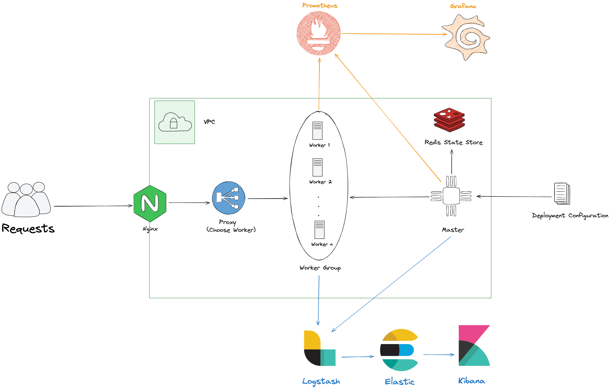
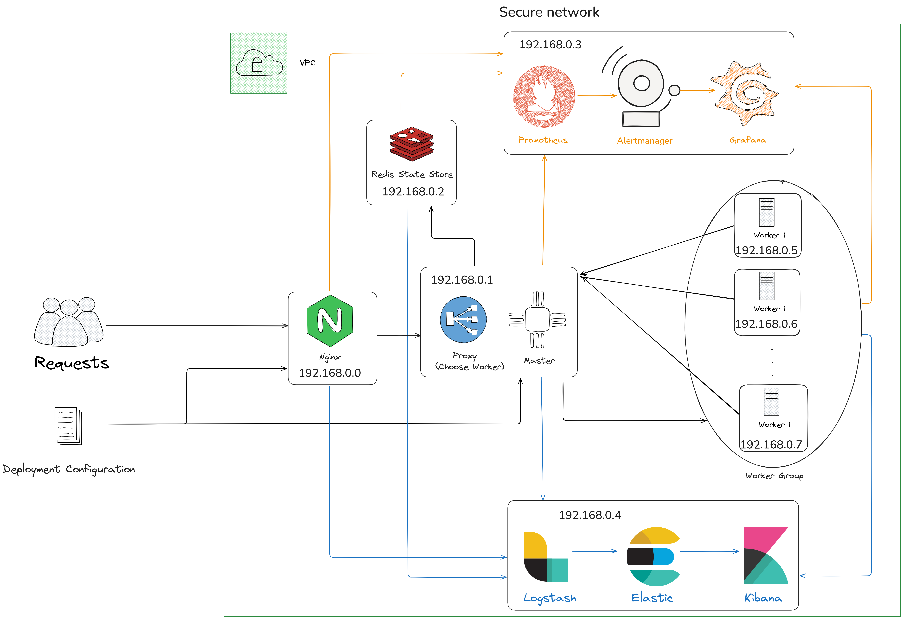

# orchestrify
My university proposal on orchestration

- [orchestrify](#orchestrify)
  - [Problem Description](#problem-description)
    - [Architecture](#architecture)
    - [Architecture - Server Deployment](#architecture---server-deployment)
  - [Run project](#run-project)

## Problem Description
In this project, we implemented an orchestration system based on Docker that ensures if the response time of a container exceeds 100 milliseconds, a new container is launched on a different worker node to maintain optimal performance with minimal resources.

We used 'Prometheus', 'Alertmanager', and 'Grafana' for monitoring the worker nodes, while 'ELK' was used for collecting application logs. Additionally, 'Nginx' was employed as a reverse proxy.

### Architecture


### Architecture - Server Deployment


## Run project
To run this program, please note that at least one master node and one worker node are required.

Use the following command to register each worker:
```bash
python -m worker.app --master-ip http://MASTER_IP:18080
```
All the following commands must be executed on the master node.

Use the following commands to add images:
```bash
python -m master.app --image-name IMAGE_NANE --environment KEY:VALUE --port HOST:CONTAINER --name CONTAINER_NAME
```
This command displays a list of all registered workers:
```bash
python -m master.app --nodes
```
With this command, detailed information about any worker can be viewed:
```bash
python -m master.app --node WORKER_ID
```
To delete a worker from the cluster:
```bash
python -m master.app --node-del WORKER_ID
```
This command displays a list of all containers launched by the cluster:
```bash
python -m master.app --procs
```
With this command, detailed information about any container can be viewed:
```bash
python -m master.app --proc CONTAINER_ID
```
To delete a container from the cluster:
```bash
python -m master.app --proc-del CONTAINER_ID
```
To run a container through the application proxy, use the following command:
```bash
curl -X POST http://PROXY_IP:8080/proxy -H "Content-Type: application/json" -d '{"name": "IMAGE_NAME", "method": "GET"}'
```

## Links that can be used to better understand
For more information read this:
* [Docker Roadmap](https://roadmap.sh/docker)
* [Get Docker](https://docs.docker.com/get-started/)
* [Swarm mode](https://docs.docker.com/engine/swarm/)
* [What is Docker Swarm](https://www.simplilearn.com/tutorials/docker-tutorial/docker-swarm)